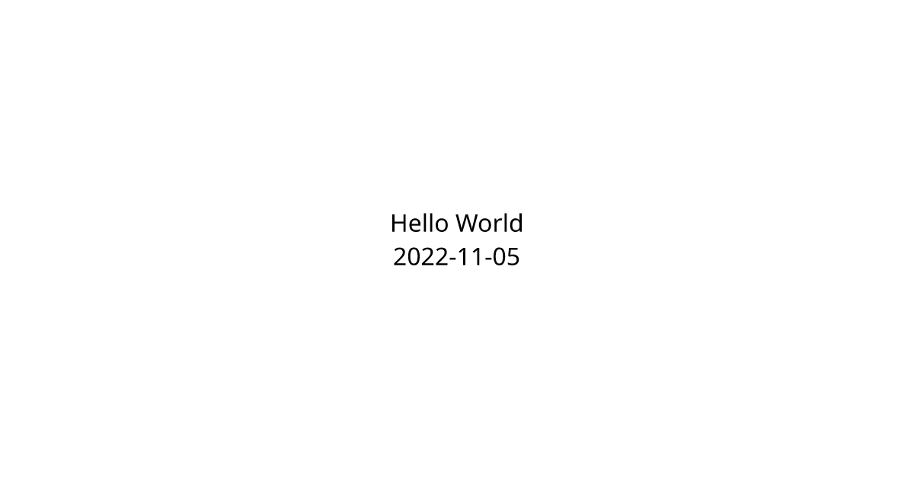

In October 2022, Vercel open sourced [Satori](https://github.com/vercel/satori), a new library that enables React users to generate SVGs on the edge. This release unlocked the potential for faster generation of customizable images.

In this guide, we will use [og-edge](https://github.com/ascorbic/og-edge), a forked version of Satori ported to Deno by [Matt Kane](https://twitter.com/ascorbic), to generate open graph images on the edge with Netlify in your Astro project.

## Getting started

Create a new Astro project using the CLI:

```sh
npm create astro@latest
```

Install the [Netlify CLI](https://docs.netlify.com/cli/get-started/#installation) globally on your machine to run Netlify edge functions locally during development:

```sh
npm install -g netlify-cli
```

Create a new file called `og.tsx` inside the `netlify/edge_functions` folder in the root of your project.

Finally, create a new file called `netlify.toml` in the root of your project and add the following configuration:

```toml title="netlify.toml"
[[edge_functions]]
    function = "og"
    path = "/og-image"
```

This configuration file declares a new edge function named `og` and replaces the default Netlify edge function path from `/.netlify/edge_functions/og-image` to `/og-image`.

## Creating an og image generator

In the `og.tsx` file, you will create a new edge function that generates an open graph image based on the query parameters provided in the URL.

```tsx title="netlify/edge_functions/og.tsx"
import React from "https://esm.sh/react@18.2.0";
import { ImageResponse } from "https://deno.land/x/og_edge@0.0.2/mod.ts";

export default function handler(req: Request) {
  const params = new URL(req.url).searchParams;
  const title = params.get("title") || "Created with Netlify edge functions";
  const pubDate = params.get("pubDate") || new Date().toISOString();

  return new ImageResponse(
    (
      <div
        style={{
          height: "100%",
          width: "100%",
          display: "flex",
          flexDirection: "column",
          alignItems: "center",
          justifyContent: "center",
          backgroundColor: "#fff",
          fontSize: 32,
        }}
      >
        <div>{title}</div>
        <div>{pubDate}</div>
      </div>
    ),
  );
}
```

## Testing an edge function locally

To test your edge function locally, run the following command in the root of your project:

```sh
netlify dev
```

This will start a local development server on [localhost:8888](http://localhost:8888).

To test the edge function, navigate to [localhost:8888/og-image?title=Hello%20World&pubDate=2022-11-05](http://localhost:8888/og-image?title=Hello%20World&pubDate=2022-11-05) in your browser. You should see a blank example of an og image.



## Get creative

You have the freedom to customize the image as desired. Feel free to add more query parameters, modify the styling, or add additional elements.

For inspiration, here is the open graph image generated for this post.


